この記事は[苫小牧高専アドベントカレンダー2020](https://adventar.org/calendars/5574) 18日目の記事です。

この記事を読んでいる方は、きっと一度は手書きレポートを課されたことあると思うのですが、めんどくさいと思ったことはありませんか？

この記事では「手書き"風"レポート」を手書きロボットで作成する方法を紹介します。

## 必要なもの

- パソコン
- 紙とプリンタとボールペン もしくは タブレットとタッチペン
  - 自分の手書きフォントを作るのに必要です。お好きな方でどうぞ。
- お金
  - ペンプロッタ 約5000円〜15000円
    - 手書きロボットのことです。
  - Calligraphr (自分の筆跡の手書きフォント作成するサブスクのサービス) 約1000円/月
    - レポートを書くのに必要な文字を、1度だけ書きます。
    - フォントを作りたいときだけ払えばOKです。
    - 75文字以内のフォントなら無料ですが、お金を払ってしまった方が楽です。

## ペンプロッタの購入

[Aliexpress で「drawbot pen」と検索](https://www.aliexpress.com/wholesale?SearchText=drawbot+pen)して出てくるやつを買えばいいと思います(適当)。英語ですけどどうにかなります(手書きレポートを書くよりは100倍マシ)。ここでは「Arduino 互換品」と「CNC シールド」を使っている前提で進めます。というわけで「Arduino」とか「CNC」とかが説明にあれば9割方間違い無いです。英語ですがどうにかなります。注文後、中国から安い船便で1〜3ヶ月ぐらい後に届くので、気長に待ちましょう。

「口」の字型と「十」の字型がありますが、「十」の字型の方が保管のスペースが少なくて済むのでおすすめです。

## ペンプロッタの組み立てとセットアップ

[こちらの記事](https://sousaku.hatenablog.jp/entry/2019/08/17/075753)が参考になりすぎるので、（そして組み立てをしたのは1年半以上前で覚えていないので）ここではざっくり書いておきます。

### 組み立て

部品がつまった箱が届きます(ほどんどが商品名に `DIY` と書いてあるので組み立て済みで届くことは稀)。僕の場合は説明書が箱の中に入っているわけではなく、販売者から組み立ての説明書のダウンロードリンクが送られてきました。英語か中国語かの説明書だったはずですが、前述の記事と説明書の図でどうにか組み立てました。このあたりをおさえてあれば、雰囲気でやってもどうにかなります（なりました）。

### Grbl の書き込み

実際、送られてきたものに書き込み済みかもしれないのでこの手順をすっ飛ばしても大丈夫です。何かがおかしい感じがしたらは自分で書き込みましょう。

Aliexpress で購入できるペンプロッタはだいたい、モーターがx軸、y軸にそれぞれ割り当たっているのではなく、2箇所に固定したモーターとギアベルトで動く [CoreXY](https://corexy.com) という構造(?)設計(?)になっているので、普通に書き込みをすると「x軸方向だけの移動のはずなのに変な方向に動き始める」とかが起きます。

[`config.h` の189行目](https://github.com/gnea/grbl/blob/eefe2bb95bb7b21ec2bb87e6ab6e20747e1626c4/grbl/config.h#L189)のコメントアウト `//` を外して書き込みしましょう。これでx軸とy軸の制御が正しくできるようになります。

### bCNC のインストール

#### 動作確認

インストールが終わったら、ペンプロッタをPCに接続して bCNC を起動してみましょう。ペンプロッタは起動したときの場所が原点`(0,0)`になるので、接続する前に原点っぽい位置にしておきましょう。
起動したら、上部の `File` を押して、左下にある `Serial` 内の `Port` から、ペンプロッタのArduinoっぽいものを選択して、`Open` を押しましょう。ペンプロッタからカチッと音がするかもしれません。

接続ができたら、上部の `Control` を押して、左下の `Control` 内の矢印でペンプロッタが動けばOKです。
動く方向が逆だったら、おそらく原点の位置を間違えているので、位置を直して接続からやり直しましょう。

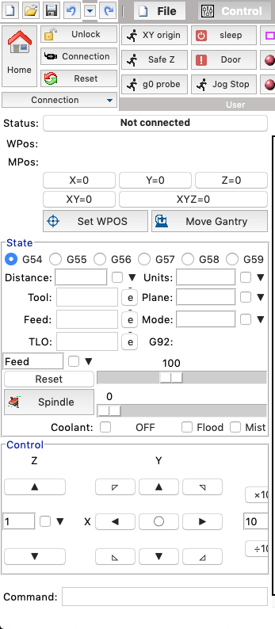

また、ペンプロッタのペンの上げ下げをするコマンドが説明書等の記述で動くか、下の `Command: ` に入力するとわかります。僕は `M05 S0` が下げる、`M03 S255` が上げるでした。

## 手書きデータの作り方

### 元データの作成

レポート用紙の大きさに合わせて Word なり、PowerPoint なりで作りましょう。当然その大きさで手書きデータを作成することになるので、文字の大きさだったり1行の設定だったりはきっちりやりましょう。さもなくば罫線とは…なレポートになってしまいます。

図は、画像ではなくPowerPointで書けば大方うまくいきます。ですが、同じ図を大量に書くとかでない限り、図は横着せずに手書きした方が速いと思います。

### 手書きフォントの作成

[Calligraphr](https://www.calligraphr.com) に登録して、[Calligraphr - Upgrade](https://www.calligraphr.com/en/upgrade/)から有料版を購入します。
使っている文字の数75文字以下なら無料でできますが、レポートで無料版で済ませるのは絶望的なのでさっさと買ってしまいましょう。

元データで使っている文字だけのフォントを作ります。
`Template` → `Arbitary characters` を選ぶと、

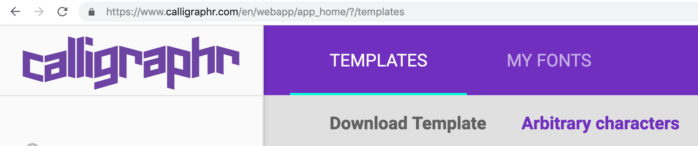

テキストボックスが出てくるので、

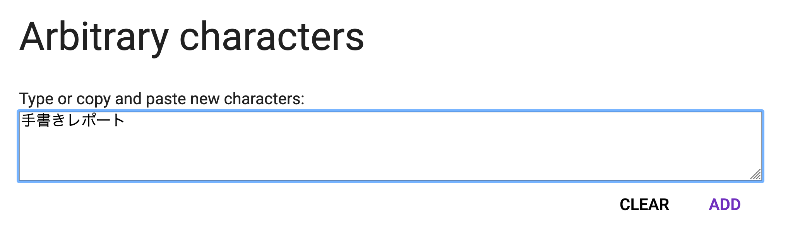

完成した元データのテキストを全選択をして全ての文字をコピぺしましょう。

Add を押して閉じます。

レポートで使っている文字が一覧になっています。これから手書き用紙をダウンロードして書き込みます。
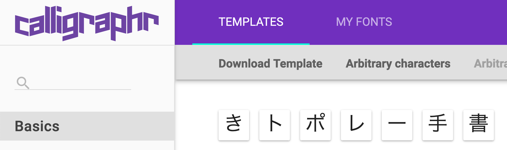

`Download Template` でPDFをダウンロードして、印刷やタブレットで書き込みましょう。
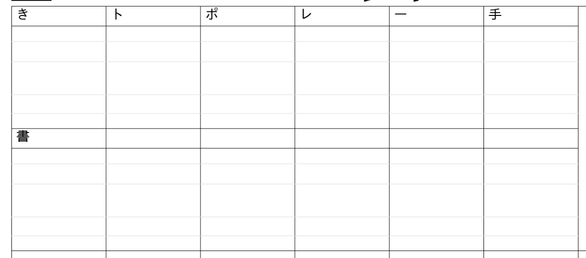

書き込み終わったら、`MYFONTS` の `Upload Template` で PDF をアップロードしましょう。最後に Build Font を押せばフォントファイルをダウンロードできるので、自分のパソコンにフォントを追加しましょう。
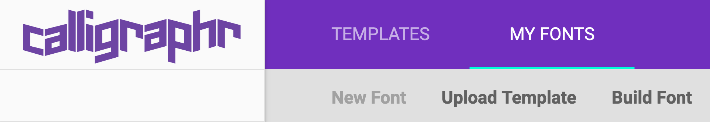

### 元データの手書きフォント化

先ほど作成した元データを開いて、全てのページの字を自作フォントに変えると、手書きデータの完成です。

### ペンプロッタ用のデータへ変換

ペンプロッタを動かすには、「Grblの書き込み」で登場した「G-Code」というものに変換する必要があります。
ただ、Word や PowerPoint のデータから直接 G-Code への変換はできない(ソフトウェアがない)ので、

> Word / PowerPoint → PDF → SVG → G-Code

という順番に変換します。

#### Word / PowerPoint → PDF

Word や PowerPoint で PDF として保存をするだけです。この記事を読むような人であれば、誰でもできますね！

#### PDF → SVG

`pdf to svg` とかでググって出てくる適当なやつでちゃちゃっとできます。ただ複数ページがまとまっているPDFとは違い、SVGは1ページ1ファイルです。

#### SVG → G-Code

最初にデザインツールのInkscapeと、その拡張機能のGcodetoolsを導入する必要があります。
[Inkscape](https://inkscape.org/ja/)をパソコンにインストールします。
インストール後、[Gcodetools](https://github.com/cnc-club/gcodetools)ページの `Code` → `Download ZIP` からダウンロードして、Inkscapeの拡張機能を入れるフォルダ `extensions` に追加します。
(`extentions` の場所は環境によって異なるようなので調べてください)
これで導入は完了です。

この先はSVGファイル1つひとつ行う必要があります。

SVGファイルをInkscapeで開いて、`エクステンション` → `Gcodetools` → `Path to Gcode` を選びます。
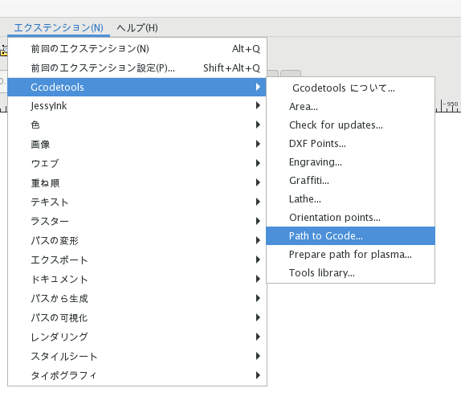

`Preferences` で保存先を書いたら、`Apply` を押して G-Code を作成します。長くても数分後にはファイルが出来上がります。
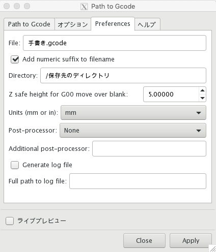

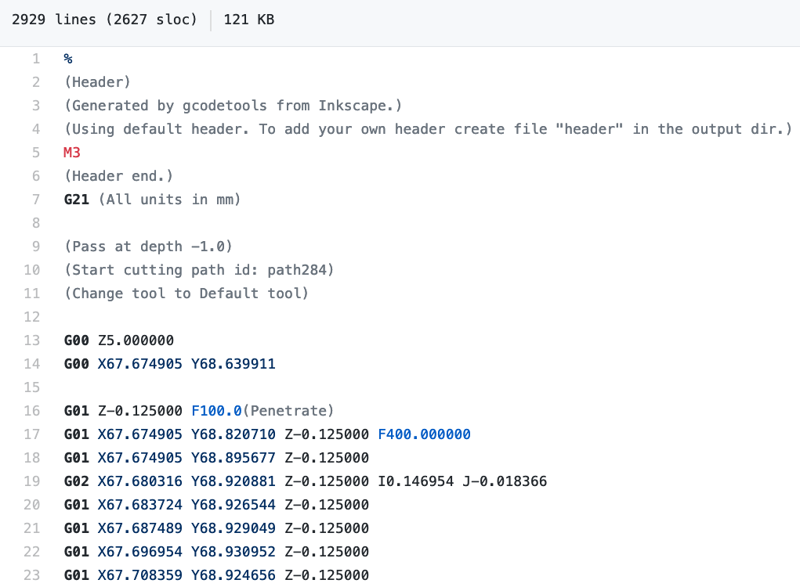

作成した G-Code そのままでは、ペンの上げ下げが動かないので、生成された G-Code ファイルを少し編集します。

テキストエディタ等で開いて、こんな感じに置換してください。

| 箇所 | 変更前 | 変更後 |
| :-- | :-- | :-- |
| ペンを上げるところ | `G00 Z5.000000` | `M03 S255`   `G4 P0.05` |
| ペンを下げるところ | `G01 Z-0.125000 F100.0(Penetrate)` | `G01 Z-0.125000 F100.0(Penetrate)`   `M05 S0`   `G4 P0.3` |

ちなみに `F100.0` の値を大きくすると、ペンプロッタの動作が早くなります。編集例はこんな感じです。

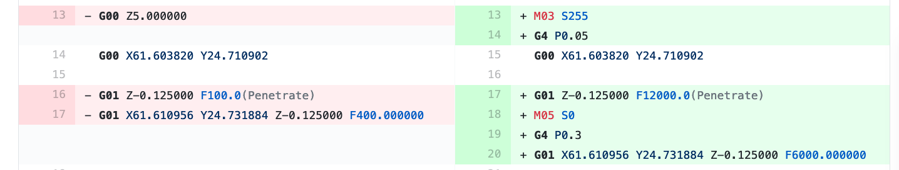

### ペンプロッタで手書きレポート作成！！！

G-Code の編集が終わったら、インストールしたbCNCに戻って、(終了した場合はペンプロッタと接続し直して) 上部の `File` → `Open` からG-Codeファイルを開きます。

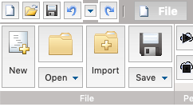

右部に動作の予定図が表示されるのを確認したら、紙を下において、`Control` → `Start` でペンが動き始めます。

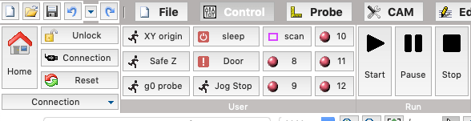

あとはこれを眺めていれば手書きレポートの完成です。

